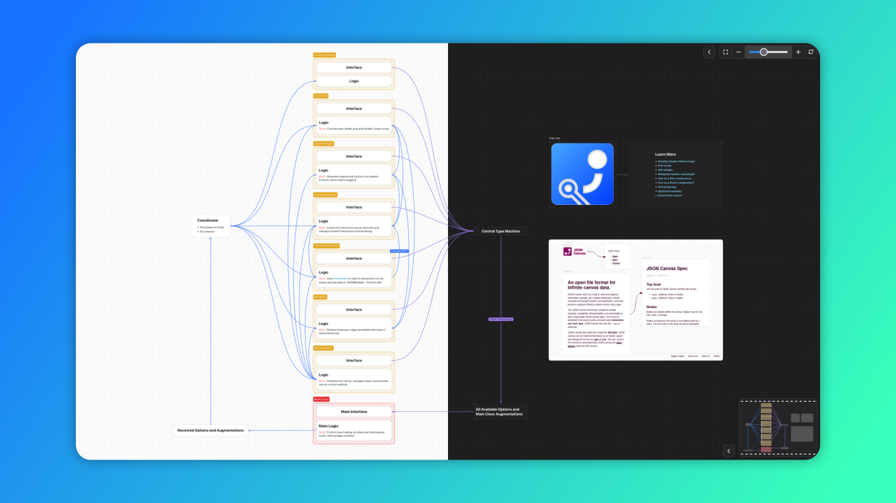

<h1 align="center">
    
    <br />
    JSON Canvas Viewer
    <br />
</h1>

<h4 align="center">An extensible web-based viewer for JSON Canvas</h4>

<p align="center">
    <a href="https://www.npmjs.com/package/json-canvas-viewer">
        
    </a>
    <a href="https://bundlephobia.com/package/json-canvas-viewer">
        
    </a>
    <a href="https://github.com/hesprs/json-canvas-viewer/actions">
        
    </a>
    <a href="https://www.codefactor.io/repository/github/hesprs/json-canvas-viewer">
        
    </a>
    
    <a href="https://snyk.io/test/npm/json-canvas-viewer">
        
    </a>
    <a href="https://github.com/hesprs/json-canvas-viewer/wiki">
        
    </a>
    
</p>



<p align="center">
    <a href="https://hesprs.github.io/json-canvas-viewer">
        <strong>Demo</strong>
    </a> • 
    <a href="https://github.com/hesprs/json-canvas-viewer/wiki">
        <strong>Documentation</strong>
    </a> • 
    <a href="https://jsoncanvas.org/">
        <strong>About JSON Canvas</strong>
    </a>
</p>

## 🐶 Features

- View JSON Canvas files (`.canvas`) in a web browser
- Embed into websites easily
- Interactive pan and zoom functionality
- Can display 100% of canvas features described in the [official spec](https://jsoncanvas.org/spec/1.0/)
- Responsive design with mobile and touchpad adaptation
- Supports Lazy loading
- TypeScript native
- Modern aesthetics with light and dark mode support
- A [chimp version](https://github.com/hesprs/json-canvas-viewer/wiki/1-%F0%9F%9A%80-Quick-Start#-chimpanzee-version) specially designed for fast trial is available
- 🔥 More performant than rendering canvases in Obsidian!
- 🧩 Out-of-the-box extensibility and tree-shaking, current optional modules include:
  - [`Minimap`](https://github.com/hesprs/json-canvas-viewer/wiki/3-%F0%9F%A7%A9-Modules#minimap) for easy navigation
  - [`Controls`](https://github.com/hesprs/json-canvas-viewer/wiki/3-%F0%9F%A7%A9-Modules#controls) displays zoom in/out and fullscreen buttons
  - [`MistouchPreventer`](https://github.com/hesprs/json-canvas-viewer/wiki/3-%F0%9F%A7%A9-Modules#mistouch-preventer) prevents the canvas from intercepting page scroll.
  - [`DebugPanel`](https://github.com/hesprs/json-canvas-viewer/wiki/3-%F0%9F%A7%A9-Modules#debug-panel) displays scale and position data.

## 🧩 Integration with Existing Paradigms

JSON Canvas Viewer currently can work seamlessly with the following techstacks / technologies (including but not limited to):

- ✅ Vanilla JS/TS: natural support
- ✅ Prerendering: [`renderToString`](https://github.com/hesprs/json-canvas-viewer/wiki/4-%F0%9F%96%87%EF%B8%8F-Prerendering-and-Bridges#prerendering)
- ✅ Vite: [Vite Plugin](https://github.com/hesprs/json-canvas-viewer/wiki/1-%F0%9F%9A%80-Quick-Start#vite)
- ✅ Webpack: [Webpack Loader & Plugin](https://github.com/hesprs/json-canvas-viewer/wiki/1-%F0%9F%9A%80-Quick-Start#webpack)
- ✅ Vue: [Vue Component](https://github.com/hesprs/json-canvas-viewer/wiki/4-%F0%9F%96%87%EF%B8%8F-Prerendering-and-Bridges#vue-component)
- ✅ React: [React Component](https://github.com/hesprs/json-canvas-viewer/wiki/4-%F0%9F%96%87%EF%B8%8F-Prerendering-and-Bridges#react-component)

🙌 Contributions are welcomed!

## 🦾 It's the Age of Agents

Your time is expensive, do not spend it on reading the lengthy docs of a niche library. Nowadays coding agents are smart enough to handle the viewer well.

Copy and paste the following prompt to OpenCode, ClaudeCode, Cursor or even a chat bot, replace the placeholder to your task, let it handle everything for you:

```markdown
I'm using `json-canvas-viewer`, a library to view JSON Canvas (from Obsidian) interactively in a browser. Read its documentations, figure out wether to use `chimp` version or `full` version, and help me with my requirements.

**Documentations**:

[Readme](https://github.com/hesprs/json-canvas-viewer/raw/refs/heads/main/README.md)
[Quick Start](https://github.com/hesprs/json-canvas-viewer/raw/refs/heads/main/docs/1-%F0%9F%9A%80-Quick-Start.md)
[Construction Details](https://github.com/hesprs/json-canvas-viewer/raw/refs/heads/main/docs/2-%F0%9F%8F%97%EF%B8%8F-Construction-Details.md)
[Modules](https://github.com/hesprs/json-canvas-viewer/raw/refs/heads/main/docs/3-%F0%9F%A7%A9-Modules.md)
[Prerendering, Vue, and React Integration](https://github.com/hesprs/json-canvas-viewer/raw/refs/heads/main/docs/4-%F0%9F%96%87%EF%B8%8F-Prerendering-and-Bridges.md)

**Requirements**:

<!-- your requirements here -->
```

## 🚀 Manual Trial in 5 Seconds

The HTML snippet below uses the `chimp` version of JSON Canvas Viewer. You also need to prepare a canvas file, if you don't have one, you can download one at [here](https://github.com/hesprs/json-canvas-viewer/blob/main/test/demo.canvas).

```HTML
<!DOCTYPE html>
<html lang="en">
<head>
	<meta charset="UTF-8" />
	<meta name="viewport" content="width=device-width, initial-scale=1.0"/>
	<title>🐒 Canvas Viewer</title>
	<style>
		body, html {
			margin: 0;
			padding: 0;
			width: 100%;
			height: 100%;
		}
	</style>
</head>
<body></body>
<script type="module">
import { JSONCanvasViewer, parser, fetchCanvas } from 'https://unpkg.com/json-canvas-viewer';
new JSONCanvasViewer({
    container: document.body, // The element to attach the viewer to
    canvas: await fetchCanvas('path/to/your.canvas'), // remember to prepare your canvas
    markdownParser: parser,
});
</script>
</html>
```

For full elaboration about the instantiation and APIs, please refer to [the documentation](https://github.com/hesprs/json-canvas-viewer/wiki).

## 🤝 Get Involved

This project welcomes anyone that have ideas to improve it.

- [Open a pull request](https://github.com/hesprs/pointeract/compare) for a new module, documentation update, and so on.
- [Open an issue](https://github.com/hesprs/pointeract/issues/new) if you find a bug.
- [Start a new thread in Discussions](https://github.com/hesprs/pointeract/discussions/new) if you have feature requests or questions, please avoid posting them in Issues.
- [Report a vulnerability](https://github.com/hesprs/pointeract/security/advisories/new) if you find one, please do not disclose it publicly.

## 📝 Copyright & License

Copyright ©️ 2025-2026 Hesprs (Hēsperus) | [MIT License](https://mit-license.org/)
